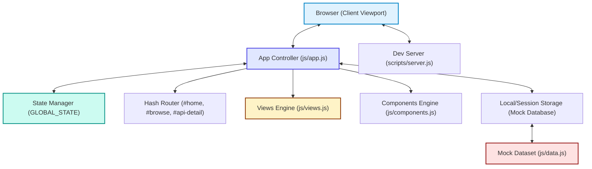
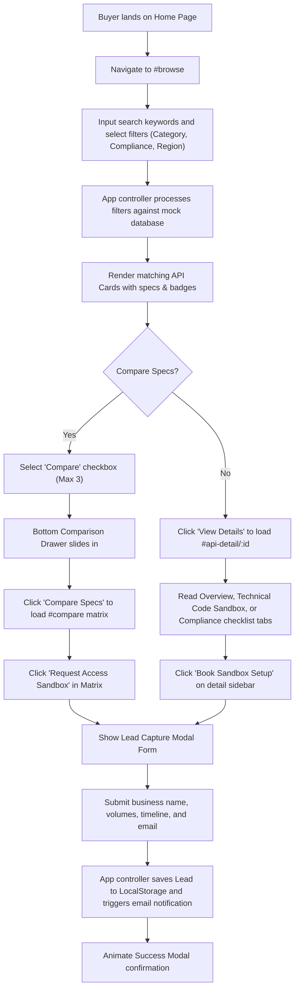
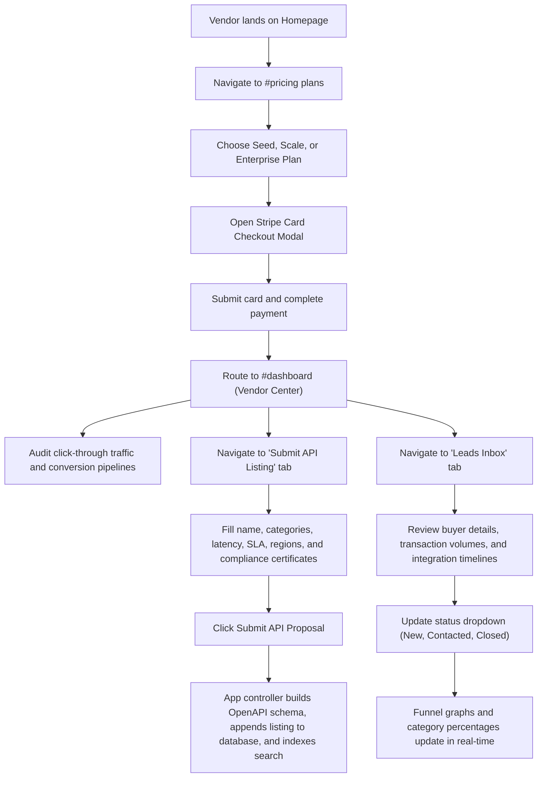

#  BankAPI Hub - B2B Fintech API Marketplace

BankAPI Hub is a curated B2B marketplace for embedded-finance and banking infrastructure APIs. It allows fintech buyers (startups, banks, NBFCs, SaaS applications) to search, filter, compare, and request sandboxed access for KYC, payments, ledger, reconciliation, cards, and fraud endpoints. Vendors can list their APIs, upgrade subscription tiers, and audit captured leads via an interactive dashboard.

---

## 🏗️ Architecture Mappings

### High-Level Architecture (SPA Architecture)

The marketplace is implemented as a client-side Single Page Application (SPA) driven by state rendering.



---

## 🔄 Core Workflows (Flowcharts)

### 1. Buyer Journey (API Discovery & Sandbox Request)

This flowchart traces a buyer discovering, filtering, comparing, and requesting sandboxed access to APIs.



### 2. Vendor Journey (Submission, Billing & Lead Auditing)

This flowchart traces a vendor listing an API, upgrading their subscription plan, and managing business leads.



---

## 🗄️ Database Schema & Entities

The mock database in `js/data.js` manages state replication across page reloads using browser `LocalStorage`.

### 1. `MOCK_VENDORS` Entity
Stores data about listed infrastructure companies:
- `id` (String, Primary Key): Unique vendor slug.
- `name` (String): Organization title.
- `logoText` (String): Initials for profile avatars.
- `color` (String): Color code for layout highlights.
- `isVerified` (Boolean): Verification check (e.g. audited security certifications).
- `rating` (Number): Average developer integration score.
- `reviewsCount` (Number): Total submitted ratings.
- `headquarters` & `founded` (String): Company demographics.
- `soc2`, `iso27001`, `pciDss`, `gdpr` (Boolean): Security checklists status.

### 2. `MOCK_APIS` Entity
Stores the infrastructure specifications for developer products:
- `id` (String, Primary Key): Unique API identifier.
- `name` & `slogan` (String): Product name and summary.
- `vendorId` (String, Foreign Key): Links to `MOCK_VENDORS.id`.
- `category` (String): `KYC` | `Payments` | `Ledger` | `Compliance` | `Cards` | `Fraud`.
- `description` (String): Detailed markdown-supported narrative.
- `regions` (Array of Strings): Geographical availability (e.g., `['US', 'EU']`).
- `pricingModel` (String): `Per-transaction` | `Volume Tiers` | `SaaS Subscription`.
- `pricingDetails` (String): Pricing structure description.
- `sandbox` (Boolean): Direct sandbox accessibility status.
- `complianceTags` (Array of Strings): Security labels.
- `integrationRating` (String): `Easy` | `Medium` | `Complex`.
- `webhooks` (Boolean): Support for HMAC signed events callbacks.
- `latency` & `uptime` (Number/String): Performance SLAs.
- `sdkLanguages` (Array of Strings): Provided integrations (e.g., `['curl', 'Node.js']`).
- `useCases` (Array of Strings): Core target applications.
- `openapiSchema` (Object): Parsed Swagger/OpenAPI path rules.
- `codeExample` (Object): Active snippets (`curl`, `javascript`, `python`).

### 3. `Leads` Entity
Captures leads and developer request metrics:
- `id` (String, Primary Key): Unique timestamp reference.
- `apiId` (String): Links to target API.
- `buyerName`, `buyerEmail`, `buyerCompany` (String): Buyer contact details.
- `companySize`, `volume`, `timeline` (String): Procurement criteria.
- `date` (String): ISO date timestamp.
- `status` (String): `New` | `Contacted` | `Closed`.

---

## 🛠️ Installation & Local Development

### Prerequisites
- Node.js installed on your local computer.

### Step 1: Clone the Repository
```bash
git clone https://github.com/ramanuja-01/BankAPI-Hub.git
cd BankAPI-Hub
```

### Step 2: Launch the Dev Server
The project includes a lightweight, zero-dependency server that runs instantly:
```bash
node scripts/server.js
```
*(If script execution permissions are enabled on your shell, you can also run `npm start` or `npm run dev`.)*

### Step 3: Browse the Platform
Navigate to **[http://localhost:3000](http://localhost:3000)** in your web browser.
- Select multiple APIs to verify the **Comparison Matrix**.
- Upgrade vendor accounts and check lead captures in the **Vendor Center**.
- Switch to **Dark Mode** to preview the slate design details.
